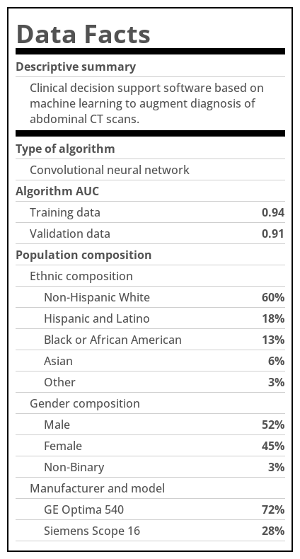

# datafacts
Quickly generate an image with population-level facts about your dataset




## Installation

If you want to use the provided demo script, I recommend setting up the
installation this way:

```
git clone https://github.com/MedleyLabs/datafacts.git
cd datafacts
pip install -e .
```

If you're going to create your own script using your own DataFrame, you can also
install it via PyPI:

```
pip install datafacts
```

## Usage

See a demo that generates a datafacts label from a hardcoded dataframe:

```
python demo.py
```

## Developer Information

To create a new distribution, first increment the version in `setup.py`, and 
then run the following:

```bash
python setup.py sdist bdist_wheel
```

To upload it to PyPI:

```bash
twine upload --skip-existing dist/*
```